Recordings of the simulations presented in 
### **"Adapting the Reverse Pyramid Airplane Boarding Method for Social Distancing in Times of COVID-19"** 
submitted to the `PLOS ONE` journal. 

Please feel free to contact us at liviu.cotfas at ase .ro for further details. 

## Boarding Scenarios

All the simulations have been performed using the following settings:
- occupancy level: 100% (120 passengers);
- luggage situation: S1 (described in our paper).

> Suggestions: 
> 1. You can download the animations below in order to watch them at a higher resolution.

### RP - 2 groups
#### Aisle distancing: 1.0m
[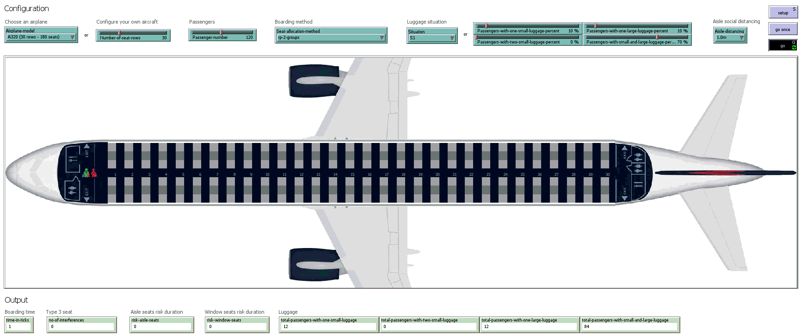](https://youtu.be/NduXKpdeSmM)
#### Aisle distancing: 2.0m
[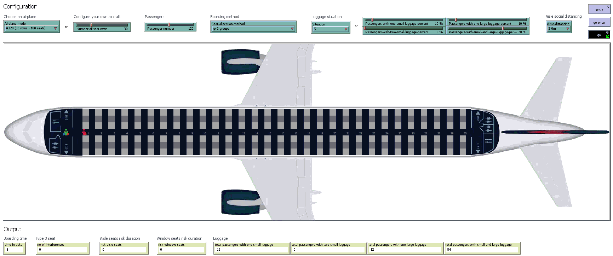](https://youtu.be/otVWfPqwZoE)
### RP - 3 groups
#### Aisle distancing: 1.0m
[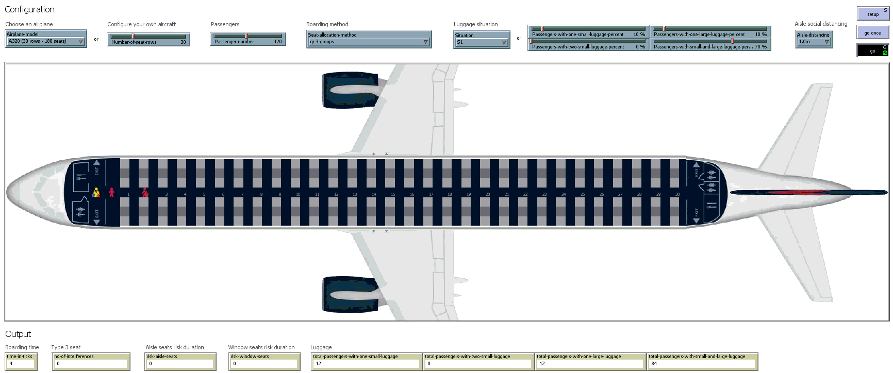](https://youtu.be/NduXKpdeSmM)
#### Aisle distancing: 2.0m

### RP-Spread - 4 groups
#### Aisle distancing: 1.0m
[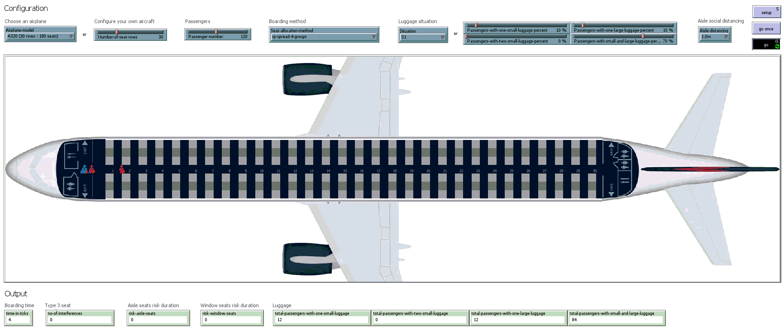](https://youtu.be/NduXKpdeSmM)
#### Aisle distancing: 2.0m
[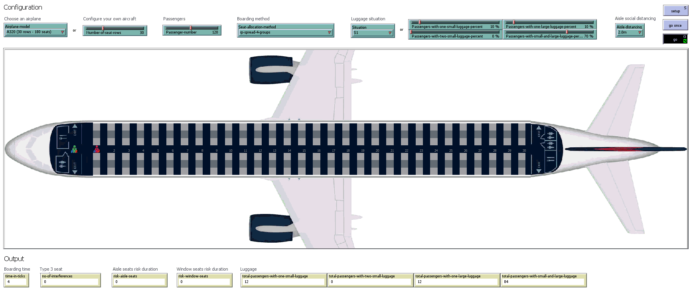](https://youtu.be/otVWfPqwZoE)
### RP-Spread - 5 groups
#### Aisle distancing: 1.0m
[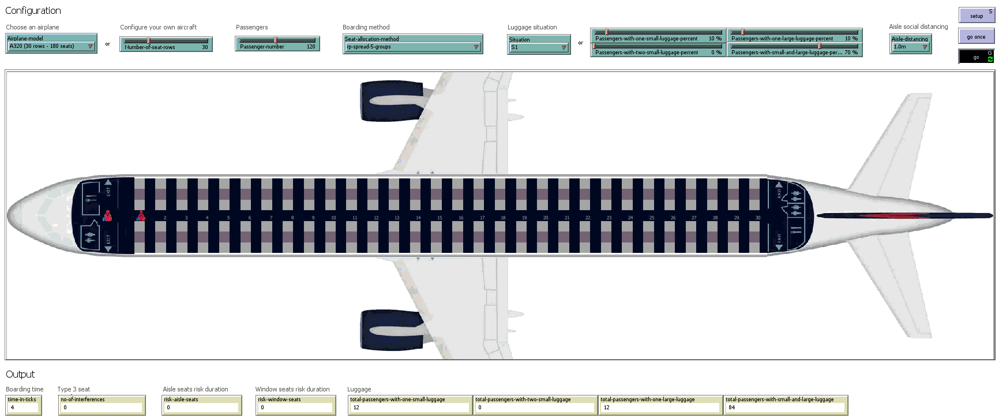](https://youtu.be/NduXKpdeSmM)
#### Aisle distancing: 2.0m
[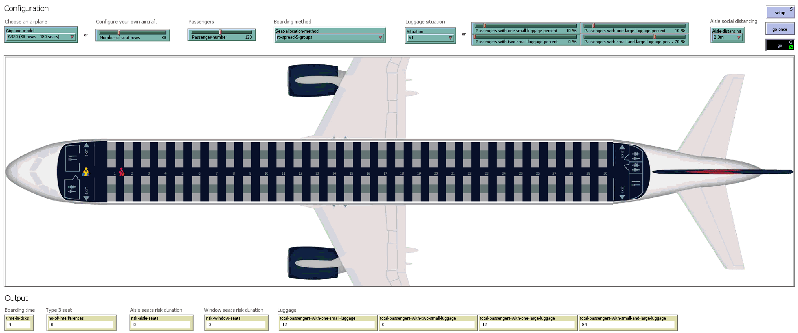](https://youtu.be/otVWfPqwZoE)
### RP-Spread - 6 groups
#### Aisle distancing: 1.0m
[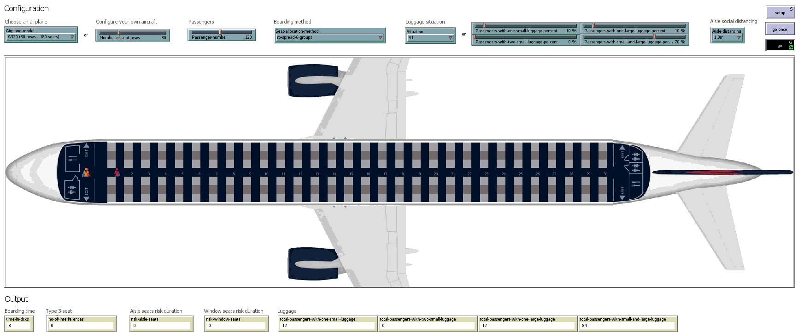](https://youtu.be/NduXKpdeSmM)
#### Aisle distancing: 2.0m
[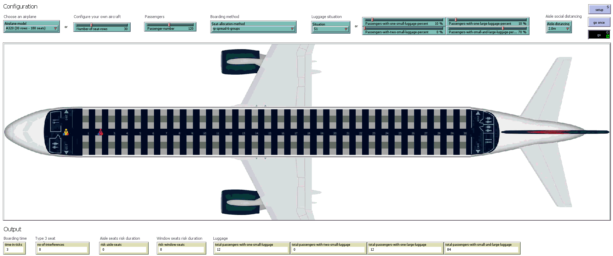](https://youtu.be/otVWfPqwZoE)
### RP-Steep - 4 groups
#### Aisle distancing: 1.0m

#### Aisle distancing: 2.0m

### RP-Steep - 5 groups
#### Aisle distancing: 1.0m

#### Aisle distancing: 2.0m

### RP-Steep - 6 groups
#### Aisle distancing: 1.0m
[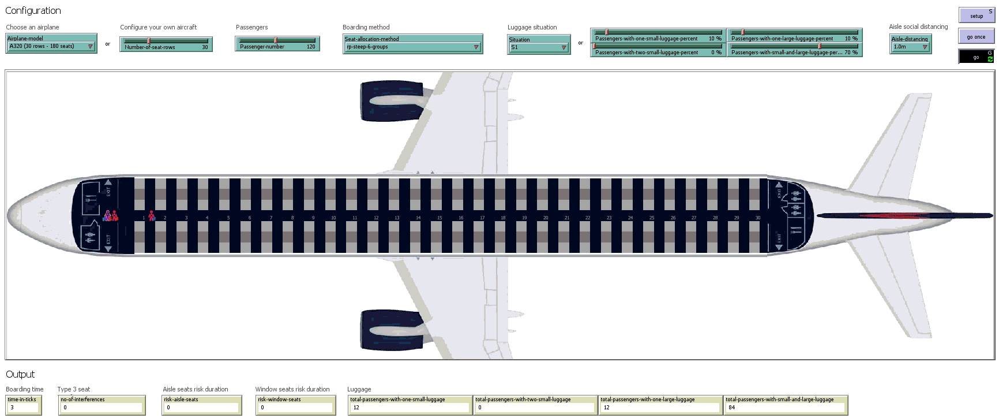](https://youtu.be/NduXKpdeSmM)
#### Aisle distancing: 2.0m
[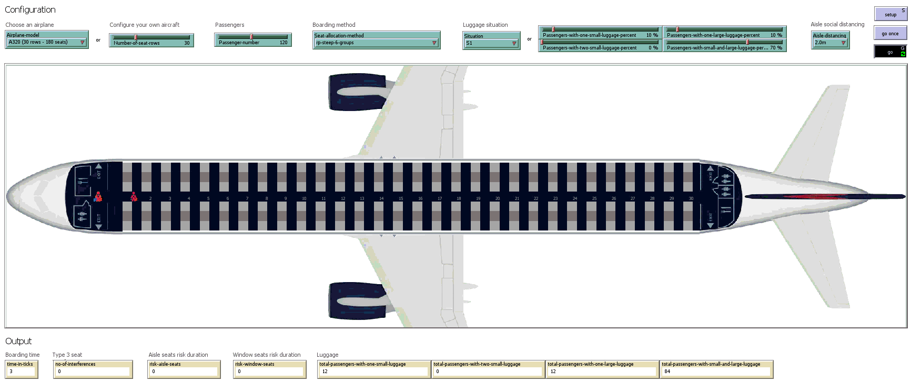](https://youtu.be/otVWfPqwZoE)